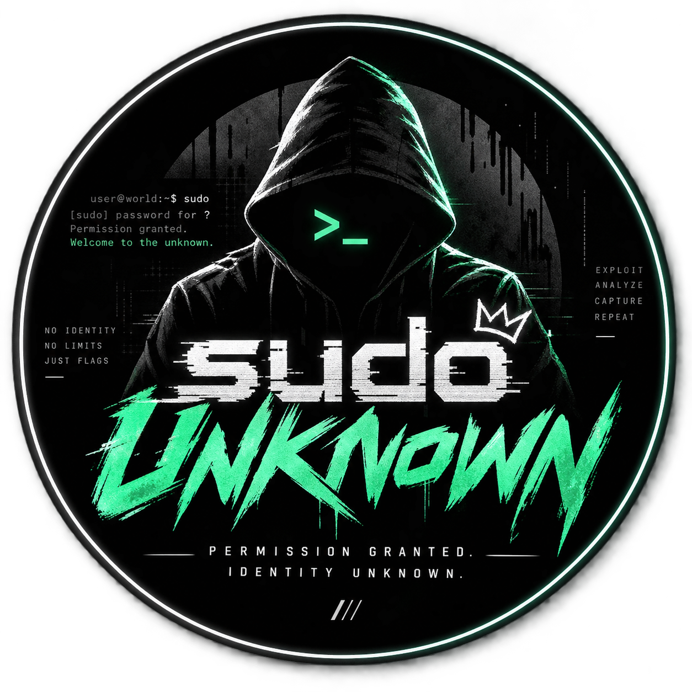

# sudo Unknown // Hack The Box CTF Team

<div align="center">
  
  <h3>Permission Granted. Identity Unknown.</h3>
  <p>
    <strong>NO IDENTITY • NO LIMITS • JUST FLAGS</strong><br />
    <strong>EXPLOIT • ANALYZE • CAPTURE • REPEAT</strong>
  </p>
  <p>
    Official Hack The Box Team ID: <a href="https://ctf.hackthebox.com/team/overview/331386"><strong>#331386</strong></a>
  </p>
</div>

---

## 🛡️ About sudo Unknown

**sudo Unknown** is a newly established, competitive cybersecurity Capture The Flag (CTF) team competing in Hack The Box seasonal leagues and international cybersecurity tournaments.

We are built on an authentic, zero-ego engineering culture: no corporate fluff, no fake accolades, just dedicated offensive tradecraft, problem-solving, and continuous improvement.

### 🌟 Founding Squad Assembly (Season 2026)
As a newly formed team, we are actively assembling our **core founding cohort**. Open specialist positions include:
- **`[OPEN]` Web Security Specialist:** Application security, modern API flaws, SSRF, SSTI, and OAuth bypasses.
- **`[OPEN]` Binary Exploitation (PWN) Lead:** Low-level memory corruption, GLIBC allocators, ROP/SROP chains, and kernel pwn.
- **`[OPEN]` Cryptography Analyst:** Attacking flawed primitives, weak PRNGs, lattice reduction, and RSA/ECC attacks.
- **`[OPEN]` Digital Forensics / DFIR:** Memory dump analysis, PCAP packet reconstruction, and filesystem timeline triage.
- **`[OPEN]` Reverse Engineering Operator:** Disassembly, anti-debugging evasion, custom VM bytecodes, and firmware reversing.
- **`[OPEN]` OSINT Specialist:** Satellite geolocation, metadata carving, and digital footprint mapping.

---

## 🎨 Visual & Brand System

- **Official Brand Mark:** Circular emblem featuring the iconic hooded operative, glowing green `>_` visor, crown emblem, and brush lettering.
- **Color Palette:**
  - Background: Deep Void (`#050505`)
  - Accent: Electric Mint / Neon Green (`#00ff88` / `#22ff99`)
  - Surfaces: Dark Graphite (`#090c0f`, `#0e1318`, `#141920`)
  - Typography: Crisp white (`#ffffff`) and slate gray (`#94a3b8`)
- **Aesthetic:** Minimalist, high-precision developer and security tool interface. No cheesy animated AI particle sludge or fake inflated numbers.

---

## ⚙️ Central Configuration

All team data, roster slots, roadmap milestones, and technical writeups are managed from a single central file:
[`src/data/teamData.ts`](src/data/teamData.ts)

- `ROSTER_SLOTS`: Manage the founding squad roles, status (`OPEN` / `FILLED`), and required skill vectors.
- `STATISTICS`: Verified squad metrics (HTB Team ID: 331386, 7 Disciplines, Forming Roster, Season 2026).
- `ROADMAP_TARGETS`: 2026 competitive calendar (HTB University CTF, Cyber Apocalypse, Pro Labs, Open CTFs).
- `TRAINING_WRITEUPS`: Reproducible methodology guides and PoC exploit scripts.
- `SITE_CONFIG`: Official Hack The Box URL, Discord, GitHub, and email comms.

---

## 🚀 Quickstart

```bash
# Clone the repository
git clone https://github.com/SmitroniX/sudo-unknown.git
cd sudo-unknown

# Install dependencies
npm install

# Start development server
npm run dev

# Build for production
npm run build
npm run preview
```

---

## 🔗 Official Comms
- **Hack The Box Team Portal:** [https://ctf.hackthebox.com/team/overview/331386](https://ctf.hackthebox.com/team/overview/331386)
- **GitHub Organization:** [https://github.com/SmitroniX/sudo-unknown](https://github.com/SmitroniX/sudo-unknown)
- **Discord Community:** [discord.gg/sudo-unknown](https://discord.gg/sudo-unknown)
